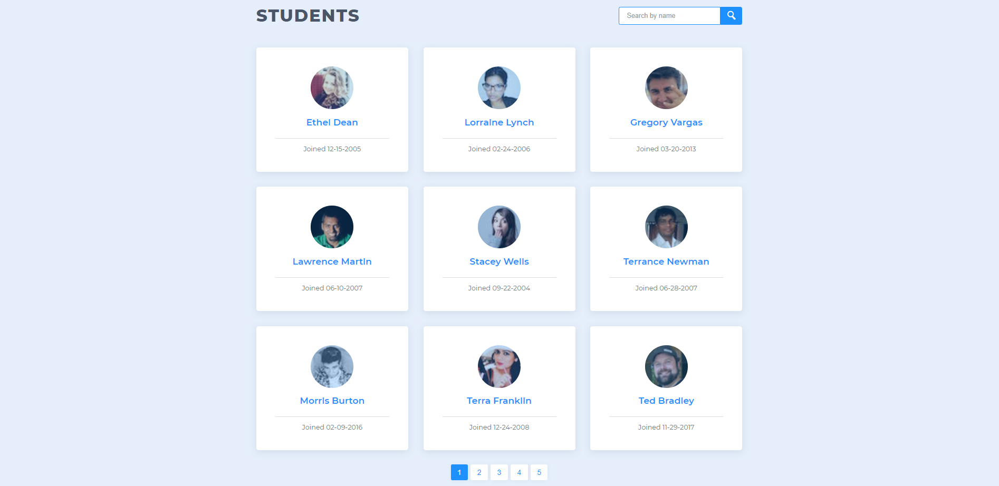

# Student List Pagination Project

## Contents
* [Introduction](https://github.com/coonsat/project-2-techdegree.git#introduction)
* [Key Concepts](https://github.com/coonsat/project-2-techdegree.git#key-concepts)
* [Getting Started](https://github.com/coonsat/project-2-techdegree.git#getting-started)

## Introduction

This project applies vanilla Javascript to break down large amounts of information into paginated segments. The data file being used contains information of 42 students, including name, email and varying sizes of pictures. Users can click on any of the dynamically created pages at the bottom of the page to change the students in focus. Although the data set for this particular exercise consisted of 42 students, the code to generate the pagination buttons can be applied to a data set of any size. 

No libraries, plugins or code snippets were used in this project. 

## Key Concepts 
* Pagination
* Modular screens
* Javascript
* HTML/CSS

## Getting Started 
1. Enter `git clone https://github.com/coonsat/project-2-techdegree.git` into the command line
2. Open a browser and copy the file path plus `index.html` into the URL. E.g. `<filePath>/index.html`
